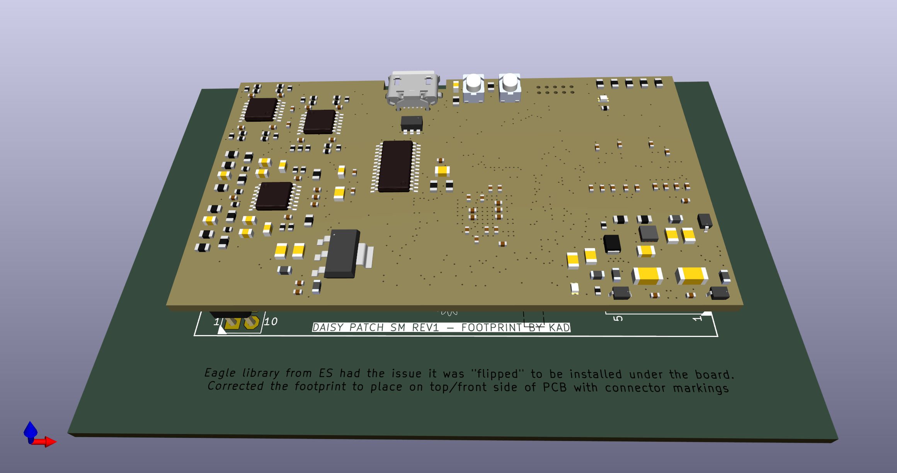
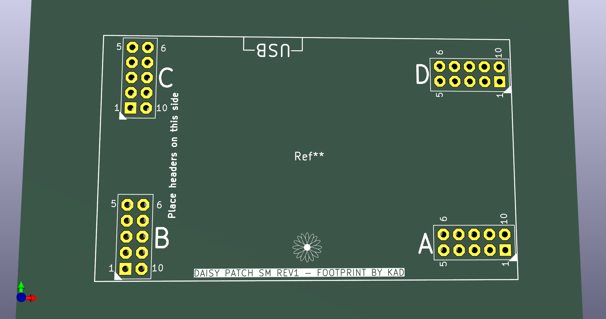

# ES-Patch-SM-KiCad-Footprint
Daisy Patch Submodule (SM) by ElectroSmith improved KiCad footprint

Eagle library from ES had the issue it was "flipped" to be installed under the board. They also staggered the pins?
https://forum.electro-smith.com/t/submodule-kicad-footprint-is-flipped/3679

Corrected the footprint to place on top/front side of PCB with connector markings.

This design is released openly to help anyone integrating the Patch SM for themselves in KiCad, it is released without any warranty or association to ElectroSmith.

